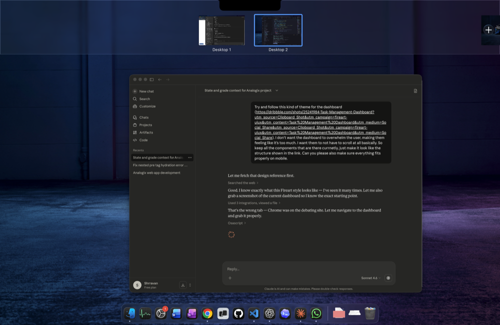

# Analogix

Analogix is an analogy-first study platform for Australian secondary students. It combines a Groq-powered AI tutor with a structured study workspace (documents, flashcards, quizzes, resources, and planning tools) so complex ideas feel intuitive and actionable.



---

## Features

### AI Learning
- Analogix AI tutor with analogy-first explanations, an analogy on/off toggle, and “re-explain” with a new anchor.
- Workspace AI agent (Quizzy) that can reference your notes, flashcards, and recent chats.
- Smart model routing for coding vs reasoning vs general questions.
- Subject, grade, and state alignment to Australian curriculum terminology.
- Formula-sheet context injected for maths/science subjects.

### Documents & Study Guides
- Per-subject document workspace with a rich editor (TipTap), math and code blocks, tables, and autosave.
- AI helper inside documents with doc-aware chat and “insert into notes”.
- Study guides generated from uploaded notes or assessment sheets and saved as editable documents.
- Notes and study guides live side-by-side inside each subject.

### Flashcards & Quizzes
- AI-generated flashcards from chat or uploaded documents, plus manual card creation.
- Spaced repetition review (SM-2) with due scheduling.
- Configurable quizzes with difficulty, timers, and AI review feedback.
- Short-answer grading and analogy hints.

### Planning & Progress
- Calendar with day/week/month views and .ics import.
- Deadlines widget and upcoming event tracking.
- Pomodoro-style study timer with session goals.
- Streaks, accuracy tracking, achievements, and activity stats.

### Personalization & UX
- Google sign-in via Supabase Auth.
- Onboarding for subjects, grade, state, and interests.
- Theme selector, tutorial overlays, and responsive UI.

---

## AI Models (Groq)

Analogix uses Groq’s OpenAI-compatible API with task-based routing:
- `meta-llama/llama-4-scout-17b-16e-instruct` (default + coding)
- `meta-llama/llama-3.3-70b-versatile` (default fallback)
- `qwen/qwen3-32b` (reasoning)
- `openai/gpt-oss-120b` (reasoning fallback)

---

## File Uploads
- Supported: PDF, DOCX/DOC, PPTX/PPT, TXT, MD, CSV, RTF, images
- Max size: 50 MB per file
- Used for chat attachments, study guides, quizzes, and flashcards

---

## Tech Stack

### Frontend
- Next.js 16 (App Router), React 18, TypeScript
- Tailwind CSS + shadcn/ui (Radix)
- Framer Motion
- TipTap editor + KaTeX + react-markdown

### Backend & Data
- Groq API (OpenAI-compatible) with smart routing
- Supabase Auth + Postgres + RLS
- Supabase SSR helpers

### Utilities
- TanStack Query
- pdf-parse + mammoth for text extraction
- ical.js for calendar import
- Vercel Analytics + Speed Insights

---

## Getting Started

### Prerequisites
- Node.js 18+
- npm or bun
- Groq API key
- Supabase project (Auth + Postgres)

### Setup

1. Clone and install dependencies:
   ```bash
   git clone https://github.com/Error403Allowed/Analogix.git
   cd Analogix
   npm install
   # or
   bun install
   ```

2. Set up Supabase:
   - Create a new Supabase project
   - Run `supabase-schema.sql` in the SQL editor
   - Enable Google Auth in Authentication → Providers
   - Add your local and production callback URLs

3. Create `.env.local` in the project root:
   ```env
   # Groq (required)
   GROQ_API_KEY=your_groq_api_key

   # Groq (optional)
   GROQ_API_KEY_2=optional_secondary_key
   GROQ_CHAT_URL=optional_custom_chat_endpoint

   # Supabase (required)
   NEXT_PUBLIC_SUPABASE_URL=your_supabase_project_url
   NEXT_PUBLIC_SUPABASE_ANON_KEY=your_supabase_anon_key

   # Supabase (optional)
   SUPABASE_SERVICE_ROLE_KEY=required_for_account_deletion

   # App (recommended for auth redirects)
   NEXT_PUBLIC_SITE_URL=http://localhost:3000
   ```

4. Start the dev server:
   ```bash
   npm run dev
   ```
   Open `http://localhost:3000` in your browser.

---

## Scripts
- `npm run dev`
- `npm run build`
- `npm run start`
- `npm run lint`
- `npm run test`

---

## Project Structure

```
src/
  app/
    api/
      groq/                 # AI endpoints (chat, quiz, study guide, extract-text)
      account/delete        # Account deletion endpoint
      health                # Environment diagnostics
    auth/callback           # Supabase OAuth callback
    dashboard, chat, quiz, flashcards, subjects, resources, formulas
    calendar, achievements, timer, study-guide-loading
  components/               # UI + feature components
  views/                    # Page-level screens
  utils/                    # Stores, helpers, parsers
  data/                     # Resources + formula sheets
```

---

## Troubleshooting

### Missing `GROQ_API_KEY`
- Add it to `.env.local` and restart the dev server.

### Auth Redirect Errors
- Set `NEXT_PUBLIC_SITE_URL`
- Whitelist the callback URL in Supabase Auth settings.

### File Upload Failures
- Check the 10 MB size limit and supported formats.

---

## Deployment

Vercel works out of the box:
```bash
npm install -g vercel
vercel
```

Add the same environment variables in your Vercel project settings.

---

## Contributing

Issues and PRs are welcome.
