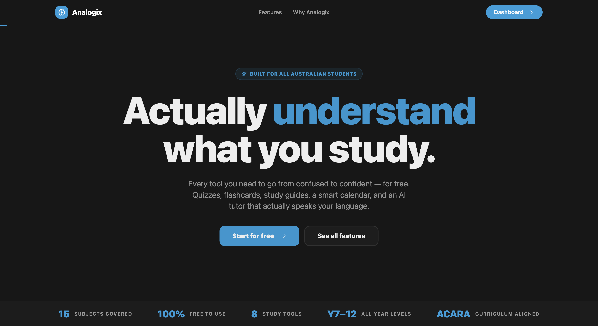
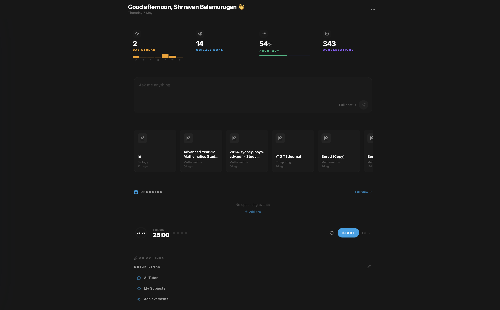
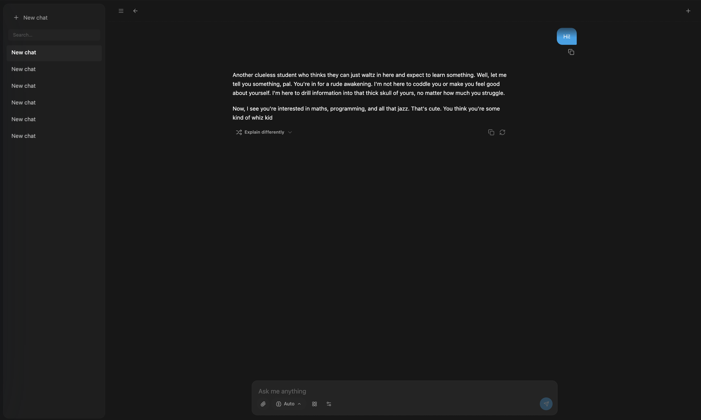
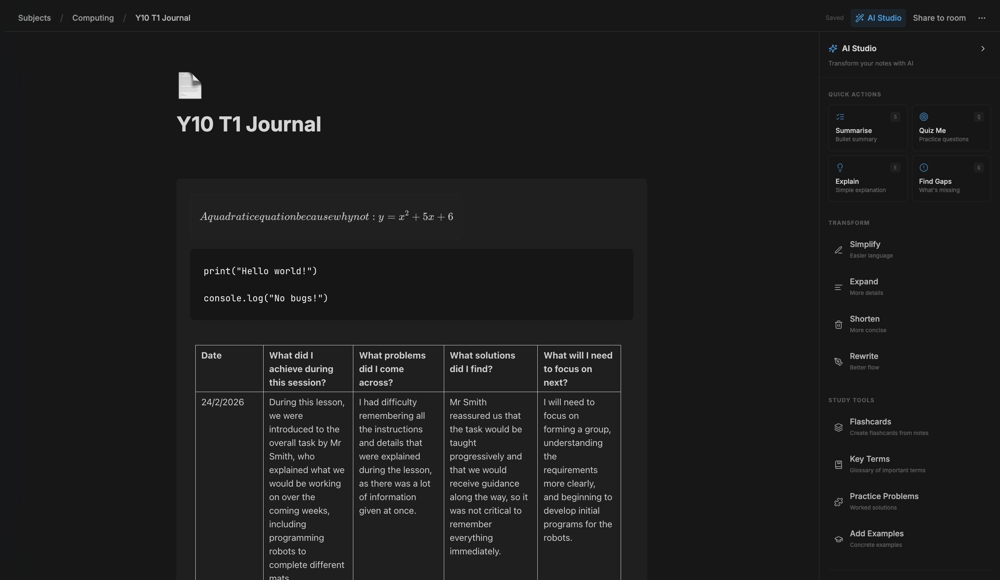
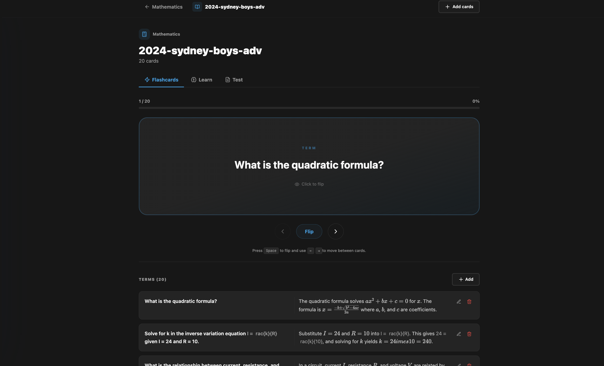
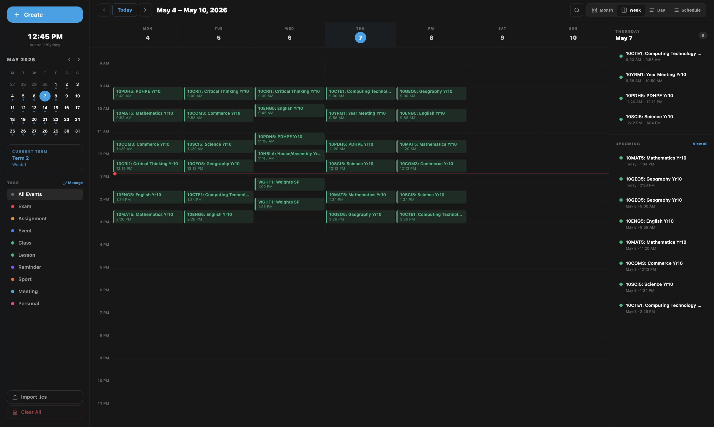
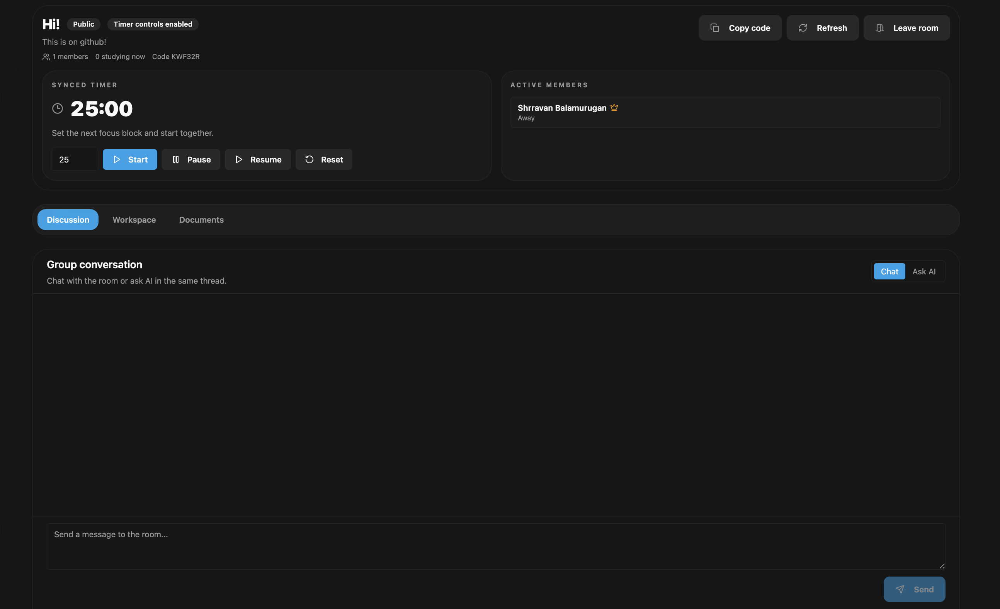
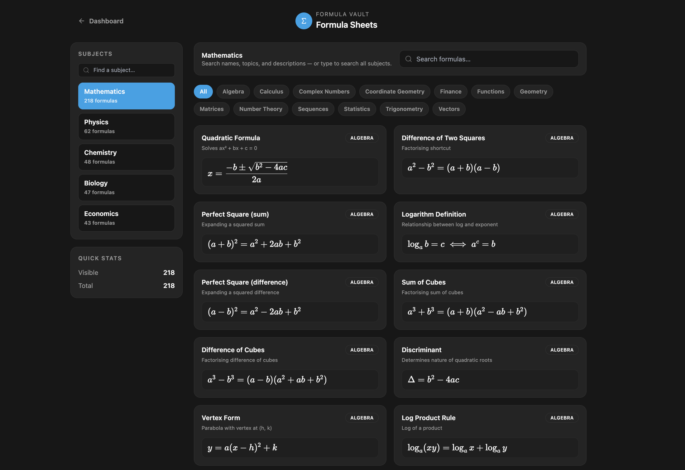

# Analogix

Analogix is an AI-powered study platform for Australian secondary students (Years 7-12). It combines a Groq-powered AI tutor with a structured study workspace (documents, flashcards, quizzes, study guides, collaborative rooms, and planning tools) so complex ideas feel intuitive and actionable.

---

## Features




### AI Learning
 
- **Analogix AI Tutor** - Analogy-first explanations woven throughout every response (not just at the end), connecting concepts to student's interests automatically
- **ACARA Curriculum Integration** - Deep knowledge of Australian Curriculum v9.0 (Years 7-12) built into the AI for curriculum-aligned responses
- **Workspace Context** - The AI has information to your calendar, documents, flashcards, and more!
- **Smart Model Routing** - Automatic routing to coding, reasoning, or general models
- **Subject Alignment** - Full ACARA curriculum knowledge with state-specific syllabus alignment (VIC, NSW, QLD, SA, WA, TAS, NT, ACT)
- **Formula Context** - Maths/science formulas injected automatically
- **AI Memory and Personality** - Analogix AI has extensive personality editing as well as presets, such as the friendly tutor, strict professor, and more! The AI tutor also saves memories, whether you want to manually add some, or it creates it itself, with the incorporated machine learning approach that saves memories about the user to further personalise and improve activity and responses
- **Study Schedule Generator** - AI creates day-by-day study schedules from calendar events
- **Assessment Guide Generator** - Upload assessment notifications (PDF) to get AI-generated study plans
- **Text-to-Speech** - TTS integration using browser SpeechSynthesis API
- **Academic Research Search** - Search academic papers via OpenAlex, Crossref, and Semantic Scholar

### Documents & Study Workspace

- **Per-subject Documents** - Rich TipTap editor with math (KaTeX), code blocks, tables, autosave
- **BlockNote Editor** - Notion-style blocks, slash commands, markdown shortcuts
- **AI Document Assistant** - Doc-aware chat with "insert into notes"
- **Document Revert** - Backup and restore previous versions
- **Yjs Collaboration** - Real-time sync using Yjs CRDT

### Flashcards & Quizzes

- **AI Flashcards** - Generated from chat or uploaded documents
- **Manual Flashcards** - Create your own with front/back
- **Spaced Repetition** - SM-2 algorithm with due scheduling
- **Adaptive Quizzes** - Difficulty levels, timers, AI review feedback
- **Short-answer Grading** - AI-powered answer evaluation
- **Analogy Hints** - Get hints framed as analogies

### Study Planning & Progress

- **Study Map** - v2 workspace for subject overview with pending tasks, document counts, and momentum scores
- **Calendar** - Day/week/month views, .ics import from school calendars
- **Deadlines** - Assignment tracking with priority levels
- **Study Timer** - Pomodoro-style sessions with goals
- **Streaks** - Daily streak tracking
- **Achievements** - Unlock badges for milestones
- **Activity Stats** - Time spent, accuracy, progress over time

### Collaboration & Rooms

- **Study Rooms** - Create rooms for subjects or projects
- **Room Members** - Invite peers to collaborate
- **Real-time Editing** - Collaborative document editing in rooms
- **Shared Flashcards** - Practice together with shared card sets

### Resources & Formulas

- **Resource Library** - Upload PDFs, DOCX, images, presentations
- **Formula Sheets** - Subject-specific formula references
- **Formula Search** - Search across all formula sheets

### Personalization & UX
- **Google Sign-in** - Supabase Auth with Google OAuth
- **Onboarding** - Select subjects, grade, state, interests
- **Theme Selector** - Light/dark mode, custom themes
- **Responsive UI** - Works on desktop and tablet
- **Emoji Picker** - emoji-mart integration
- **Toast Notifications** - Sonner toast library
- **Drawer Components** - Vaul drawer library
- **Resizable Panels** - Layout management with react-resizable-panels
- **OTP Input** - Verification code input component
- **Account Deletion** - Users can delete their accounts

---

## Pages

| Route | Page | Description |
|-------|------|-------------|
| `/` | Landing | Public landing page (v2 redesign) |
| `/login` | Login | Google authentication |
| `/onboarding` | Onboarding | Initial subject/grade setup |
| `/dashboard` | Dashboard | Home with stats, deadlines, streak |
| `/subjects` | Subjects | Subject overview |
| `/subjects/:id` | Subject Detail | Subject workspace |
| `/subjects/:id/document/:docId` | Document Editor | Rich text editor |
| `/study-map` | Study Map Home | Subject overview with pending tasks, document counts, and momentum scores |
| `/study-map/[subjectId]` | Study Map Subject | Per-subject workspace with homework/task management |
| `/chat` | Chat | AI tutor conversation (v2 ChatStudio) |
| `/flashcards` | Flashcards | Flashcard review (v2 FlashcardsStudio) |
| `/quiz` | Quiz | Quiz practice (v2 QuizStudio) |
| `/calendar` | Calendar | Event calendar |
| `/timer` | Timer | Study timer |
| `/rooms` | Rooms | Study rooms |
| `/rooms/:roomId` | Room Workspace | Collaborative room |
| `/achievements` | Achievements | Badges and milestones |
| `/resources` | Resources | File library (v2 ResourcesStudio) |
| `/formulas` | Formulas | Formula reference |
| `/support` | Support | FAQ page with quick links to GitHub issues, bug reports, and feature requests |
| `/privacy` | Privacy Policy | Detailed privacy policy |
| `/not-found` | 404 Page | Custom not-found page |

---

## AI Models

### Groq API
Analogix uses Groq API with task-based routing:

| Model | Use Case |
|-------|----------|
| `auto` | Auto-routes to best model for query |
| `llama-4-scout-17b-16e-instruct` | All-round model, specialized in maths, coding and chatting |
| `llama-3.3-70b-versatile` | Reliable and versatile for complex tasks |
| `qwen-3-32b` | Reasoning model for mathematics and science |
| `llama-3.1-8b-instant` | Lightweight model for quick questions |

### AI Frameworks
- **Vercel AI SDK** - Core AI integration (`ai` v6, `@ai-sdk/groq` v3, `@ai-sdk/react`)

---

## API Endpoints

### GraphQL API
Analogix includes a full GraphQL API layer (`/api/graphql`) using graphql-yoga and Pothos:
- **Queries**: profiles, stats, events, deadlines, flashcards, rooms, AI personality, AI memories, agents, activity logs, preferences, workspace entities, calendar integrations, quiz performance, study sessions
- **Mutations**: CRUD operations for all entities
- **Client**: Apollo Client integration

### REST API Endpoints

#### AI & Groq
| Endpoint | Description |
|----------|-------------|
| `/api/groq/chat` | AI chat conversation |
| `/api/groq/quiz` | Quiz generation |
| `/api/groq/flashcards` | Flashcard generation |
| `/api/groq/study-schedule` | AI-generated study schedule from deadlines |
| `/api/groq/assessment-guide` | AI assessment guide from PDFs |
| `/api/groq/tutor` | Dedicated tutor endpoint |
| `/api/groq/reexplain` | Re-explain concept |
| `/api/groq/quiz-review` | Quiz review feedback |
| `/api/groq/notion-ai` | Notion-style AI content generation |
| `/api/groq/banner` | Banner generation |
| `/api/groq/greeting` | Greeting generation |
| `/api/groq/extract-text` | Text extraction from documents |
| `/api/groq/study-guide-edit` | Study guide editing |
| `/api/groq/agent-action` | Agent action execution |
| `/api/groq/flashcard-from-doc` | Flashcard generation from documents |
| `/api/groq/quiz-from-doc` | Quiz generation from documents |

#### AI Operations
| Endpoint | Description |
|----------|-------------|
| `/api/ai/execute` | AI execution |
| `/api/ai/operations` | AI operations |
| `/api/ai/validate` | AI validation |

#### Utilities
| Endpoint | Description |
|----------|-------------|
| `/api/tts/speak` | Text-to-speech |
| `/api/research/search` | Academic research search (OpenAlex, Crossref, Semantic Scholar) |
| `/api/health` | Health check endpoint |
| `/api/account/delete` | Account deletion (DELETE) |

#### Documents
| Endpoint | Description |
|----------|-------------|
| `/api/documents/revert` | Document version revert |

#### Rooms
| Endpoint | Description |
|----------|-------------|
| `/api/rooms/[roomId]/presence` | Room presence tracking |
| `/api/rooms/[roomId]/timer` | Room timer management |
| `/api/rooms/[roomId]/leave` | Room leave |
| `/api/rooms/[roomId]/documents` | Room documents |
| `/api/rooms/[roomId]/documents/[documentId]` | Individual room document |
| `/api/rooms/[roomId]/members` | Room members |
| `/api/rooms/[roomId]/ai` | Room AI chat |
| `/api/rooms/[roomId]/messages` | Room messages |
| `/api/rooms/[roomId]/canvas` | Room canvas |

---

## File Uploads

- **Supported**: PDF, DOCX/DOC, PPTX/PPT, TXT, MD, CSV, RTF, images (JPG, PNG, WEBP)
- **Max size**: 50 MB per file
- **Used for**: Chat attachments, study guides, quizzes, flashcards, resources

---

## Tech Stack

### Frontend
- Next.js 16.1.6 (App Router)
- React 18, TypeScript
- Tailwind CSS + shadcn/ui (Radix)
- Framer Motion animations
- BlockNote editor (built on TipTap)
- KaTeX for math, react-markdown
- CodeMirror for code blocks
- Emoji Mart for emoji picker
- Sonner for toast notifications
- Vaul for drawer components
- React Resizable Panels

### Backend & Data
- Groq API via Vercel AI SDK (@ai-sdk/groq)
- GraphQL API (graphql-yoga, Pothos, Apollo Client)
- Supabase Auth + Postgres + RLS
- TanStack Query
- Yjs for real-time collaboration

### Utilities
- pdf-parse + mammoth (text extraction)
- ical.js (calendar import)
- @codemirror/lang-python
- jose for JWT/JOSE
- dataloader for batching/caching
- rxjs for reactive programming
- Vercel Analytics + Speed Insights

---

## Getting Started

### Prerequisites
- Node.js 20+
- npm or bun
- Groq API key
- Supabase project

### Setup

1. Clone and install:
```bash
git clone https://github.com/Error403Allowed/Analogix.git
cd Analogix
npm install
```

2. Set up Supabase:
```bash
# Create project at supabase.com
# Run migrations from supabase/migrations/
# Enable Google Auth in Authentication → Providers
```

3. Create `.env.local`:
```env
# Groq (required)
GROQ_API_KEY=your_groq_api_key
GROQ_API_KEY_2=optional_secondary_key

# Supabase
NEXT_PUBLIC_SUPABASE_URL=your_supabase_url
NEXT_PUBLIC_SUPABASE_ANON_KEY=your_anon_key
SUPABASE_SERVICE_ROLE_KEY=your_service_role_key

# Google OAuth
GOOGLE_CLIENT_ID=your_google_client_id
GOOGLE_CLIENT_SECRET=your_google_client_secret

# App
NEXT_PUBLIC_SITE_URL=http://localhost:3000
NEXT_PUBLIC_REALTIME_URL=       # Optional for production

# Optional
DESMOS_API_KEY=your_desmos_api_key
ALLOW_DEV_API=true               # Development API flag
```

4. Run:
```bash
npm run dev
```
Open `http://localhost:3000`

---

## Scripts

| Command | Description |
|--------|-------------|
| `npm run dev` | Development server |
| `npm run build` | Production build |
| `npm run start` | Production server |
| `npm run lint` | ESLint check |
| `npm run tests` | Run test suite |
| `npm run tests:list` | List available tests |
| `npm run tests:filter` | Run tests matching filter |
| `npm run tests:tag` | Run tests by tag |

---

## Project Structure

```
src/
├── app/                    # Next.js App Router pages
│   ├── api/               # API routes
│   │   ├── groq/         # AI endpoints (chat, quiz, flashcards, study-schedule, etc.)
│   │   ├── agents/       # Agentic workflow
│   │   ├── ai/           # AI operations (execute, operations, validate)
│   │   ├── graphql/      # GraphQL API endpoint
│   │   ├── tts/          # Text-to-speech
│   │   ├── research/     # Academic research search
│   │   ├── health/       # Health check
│   │   ├── account/      # Account deletion
│   │   ├── documents/    # Document operations
│   │   └── rooms/        # Room-specific endpoints
│   ├── subjects/         # Subject workspace
│   ├── study-map/        # Study Map v2 workspace
│   ├── rooms/            # Study rooms
│   └── ...
├── components/            # UI components
│   └── v2/               # v2 redesigned components
├── views/                 # Page components
│   └── v2/               # v2 studio components (ChatStudio, QuizStudio, etc.)
├── hooks/                 # Custom React hooks
├── utils/                 # Stores, hooks, parsers
├── lib/                  # Client/server utilities
│   ├── graphql/          # GraphQL layer (schema, resolvers, context, client)
│   ├── curriculum/       # ACARA curriculum data
│   ├── aiMemory/         # AI memory management
│   └── ...
├── services/             # API services
├── data/                 # Static resources (ACARA curriculum, formulaSheets, achievements)
├── types/                 # TypeScript type definitions
├── constants/            # App constants
└── context/              # React context providers
```

---

## Configuration

### Next.js Configuration (next.config.mjs)
- **Server External Packages**: `pdf-parse`, `pdfjs-dist`
- **Server Actions Body Size Limit**: 50MB
- **Package Import Optimization**: lucide-react, Radix packages, date-fns, framer-motion
- **Image Formats**: AVIF, WebP

---

## Deployment

Vercel (recommended):
```bash
npm install -g vercel
vercel
```

Add environment variables in Vercel project settings.

---

## Troubleshooting

### Missing GROQ_API_KEY
Add to `.env.local` and restart server.

### Auth Redirect Errors
Set `NEXT_PUBLIC_SITE_URL` and whitelist in Supabase Auth.

### File Upload Fails
Check file size (50MB max) and format.

### TypeScript/ESLint Errors
Run `npm run lint` and fix issues before deploying.

### GraphQL Errors
Ensure all environment variables are set and Supabase migrations are applied.

---

## Contributing

Issues and PRs welcome!