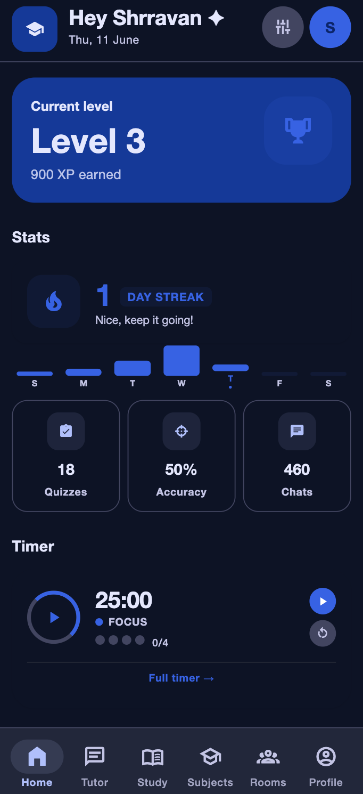
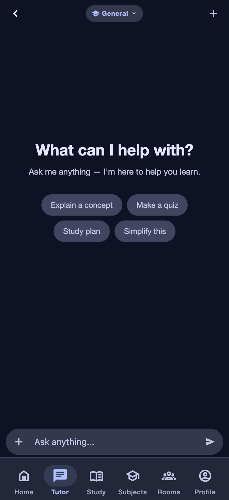
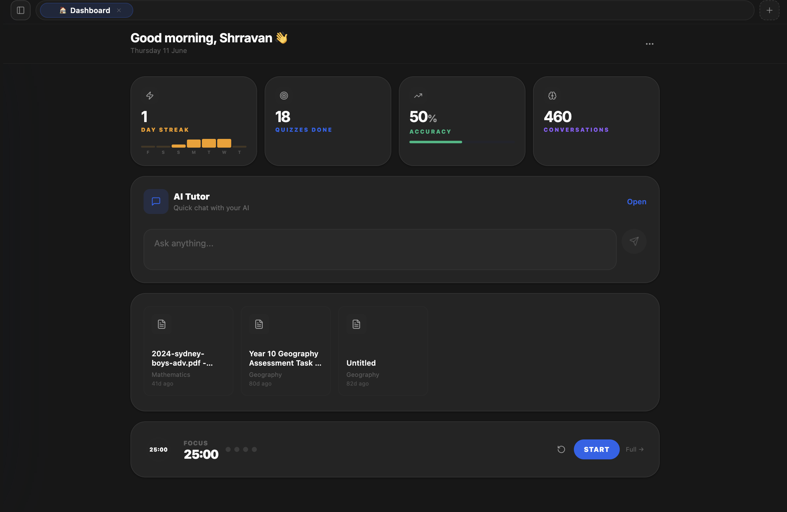
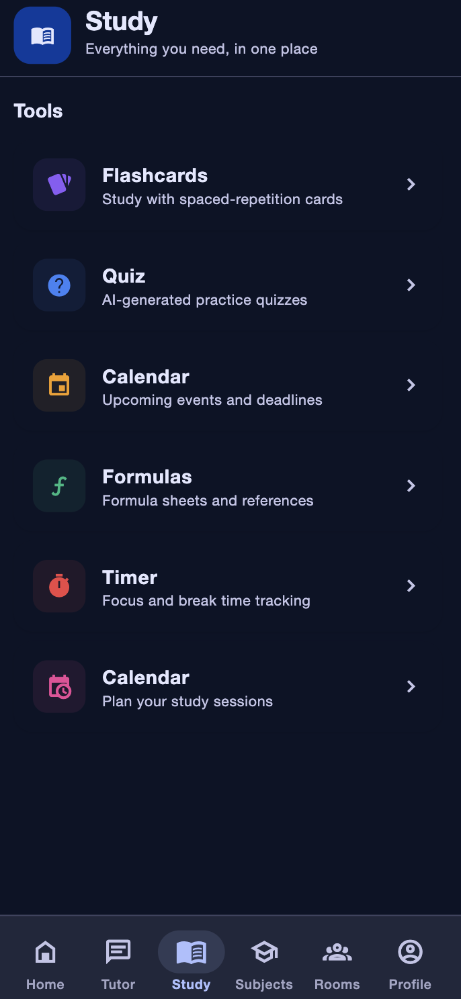
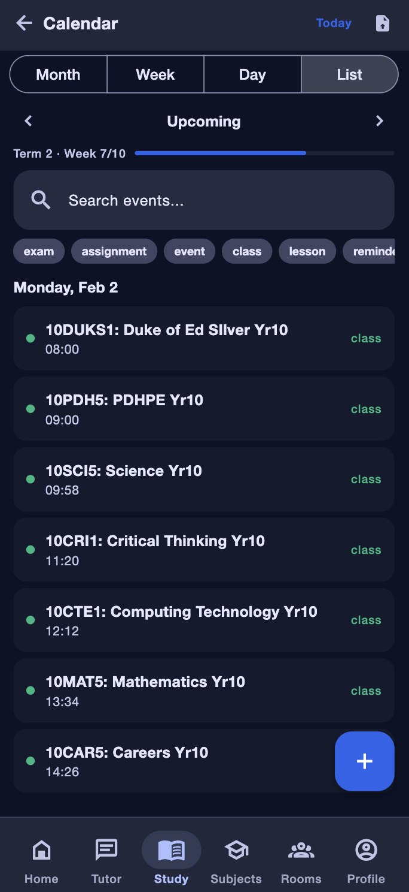
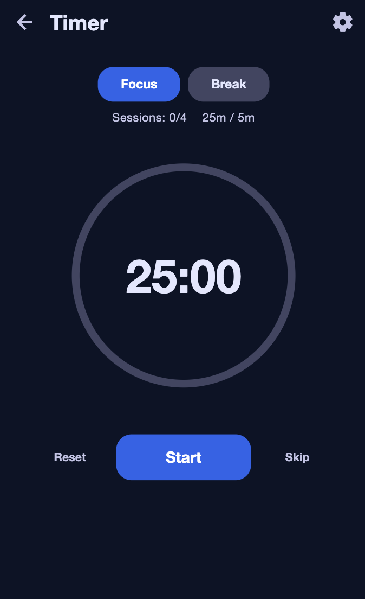
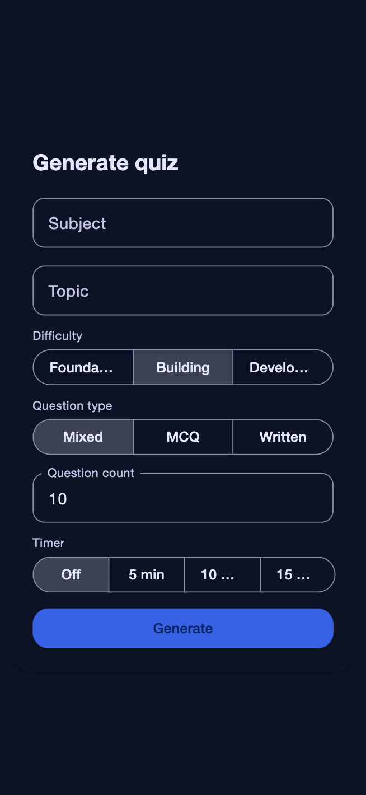

# Analogix

> Analogix puts everything all in one place, and is built specifically for students, so there's no need to switch between claude, quizlet, anki, and others.


---

## Screenshots

| Mobile Dashboard | Chat | Web Dashboard |
|:---:|:---:|:---:|
|  |  |  |
| Study Hub | Calendar | Timer |
|  |  |  |
| Quiz | | |
|  | | |

---

## Features

- **AI Tutor:** Backed by Groq. Explains concepts, generates quizzes and flashcards from your material.
- **Flashcards:** SM-2 spaced repetition. Create your own or let AI build a set from an uploaded file or chat session.
- **Quizzes:** Multiple choice, essay, or mixed. Timed or untimed. AI-generated from your content.
- **Calendar:** Day, week, or month view. Auto-calculates term dates for every Australian state, imports ICS from school portals.
- **Timer:** Configurable Pomodoro with session and streak tracking.
- **Study Schedule:** AI generates a weekly plan from your subjects and deadlines. Editable.
- **Subjects:** Track marks, homework, syllabus, with a built-in document editor.
- **Rooms:** Real-time group work with shared chat, documents, and a synced timer.
- **Formulas:** Subject-based formula sheets rendered in LaTeX. Searchable.
- **Achievements:** XP and badges to make the grind more palatable.
- **Assessment Guide:** Hand the AI an assessment PDF and it drafts a study plan.

---

## Architecture

```
                    ┌───────────────────────┐
                    │    AnalogixWeb         │
                    │  Next.js 16 + Turbopack │
                    │  REST + GraphQL client  │
                    └────────┬──────────────┘
                             │ HTTP/WS
                    ┌────────▼──────────────┐
                    │   AnalogixGraphQL     │
                    │  Apollo Server v5     │◄──── Supabase Auth (JWT)
                    │  Express 5 + graphql-ws│      Groq AI, OpenAlex
                    │  Redis PubSub         │      Supabase DB/Storage
                    └────────┬──────────────┘
                             │ HTTP/WS
                    ┌────────▼──────────────┐
                    │    AnalogixMobile      │
                    │  Expo SDK 54 + RN 0.81 │
                    │  Material 3 Expressive │
                    └───────────────────────┘
```

Key design decisions:

- Web and mobile share the same GraphQL API — no duplicate endpoints.
- Auth is handled server-side via Supabase JWT verification.
- Redis PubSub manages subscriptions for room sync and chat streaming (falls back to in-process in dev).
- Both clients share types and schemas from `@analogix/shared`. Change a Zod schema and the rest follows.

---

## The apps

| Package | Description | Tech stack |
|---------|-------------|------------|
| `AnalogixWeb` | Web client | Next.js 16, Turbopack, TypeScript |
| `AnalogixMobile` | Mobile app | React Native 0.81 (Expo SDK 54), react-native-paper, Reanimated 4 |
| `AnalogixGraphQL` | BFF / GraphQL gateway | Apollo Server v5, Express 5, graphql-ws, Redis |
| `@analogix/shared` | Common types and schemas | TypeScript, Zod, JSON manifests |
| `@analogix/mcp` | Model Context Protocol server | TypeScript, exposes app data via MCP |

---

## Getting started

```bash
# 1. Install root and workspace dependencies
npm install

# 2. Copy environment templates and add your secrets
cp AnalogixGraphQL/.env.example AnalogixGraphQL/.env
cp AnalogixMobile/.env.example AnalogixMobile/.env

# 3. Build the shared package first (required by all other workspaces)
npm run build:shared

# 4. Start the API (terminal 1)
npm run dev:api      # http://localhost:4000/graphql

# 5. Start the web client (terminal 2)
npm run dev:web      # http://localhost:3000

# 6. Start the mobile app (terminal 3)
npm run dev:mobile   # Expo dev server
```

---

## Environment variables

**AnalogixGraphQL/.env** (Server runtime)
`PORT`, `NODE_ENV`, `CORS_ORIGINS`, `SUPABASE_URL`, `SUPABASE_ANON_KEY`, `SUPABASE_SERVICE_ROLE_KEY`, `GROQ_API_KEY`, `GROQ_API_KEY_2`, `GOOGLE_CLIENT_ID`, `GOOGLE_CLIENT_SECRET`, `DESMOS_API_KEY`, `REDIS_URL`, `LOG_LEVEL`

**AnalogixMobile/.env** (Client side)
`EXPO_PUBLIC_SUPABASE_URL`, `EXPO_PUBLIC_SUPABASE_ANON_KEY`, `EXPO_PUBLIC_GRAPHQL_HTTP_URL`, `EXPO_PUBLIC_GRAPHQL_WS_URL`, `EXPO_PUBLIC_GOOGLE_*_CLIENT_ID`, `EXPO_PUBLIC_GOOGLE_REDIRECT_SCHEME`

**AnalogixWeb/.env.local** (Next.js)
`GROQ_API_KEY`, `GROQ_API_KEY_2`, `NEXT_PUBLIC_SUPABASE_URL`, `NEXT_PUBLIC_SUPABASE_ANON_KEY`, `SUPABASE_SERVICE_ROLE_KEY`, `GOOGLE_CLIENT_ID`, `GOOGLE_CLIENT_SECRET`, `NEXT_PUBLIC_SITE_URL`, `DESMOS_API_KEY`, `ALLOW_DEV_API`

---

## Root-level scripts

| Command | Function |
|---------|----------|
| `npm run dev` | Starts all workspaces in dev mode |
| `npm run dev:api` | GraphQL BFF on `:4000` |
| `npm run dev:web` | Next.js dev server on `:3000` |
| `npm run dev:mobile` | Expo dev client on `:8081` |
| `npm run dev:shared` | Watches `@analogix/shared` for changes |
| `npm run build` | Builds all workspaces in dependency order |
| `npm run build:shared` | Builds shared package first |
| `npm run typecheck` | `tsc --noEmit` across all workspaces |
| `npm run lint` | Run ESLint |
| `npm run clean` | Clears `dist/`, `.next/`, etc. |

---

## Further reading

Refer to the individual READMEs in each package for details:

- [`AnalogixGraphQL/README.md`](./AnalogixGraphQL/README.md) — schema, resolvers, deployment.
- [`AnalogixMobile/README.md`](./AnalogixMobile/README.md) — screenshots, theming, EAS builds, auth.
- [`AnalogixWeb/README.md`](./AnalogixWeb/README.md) — setup, pages, troubleshooting.

---

## License

Analogix is a private project. All rights reserved.

---

*Disclaimer: While AI has been of assistance in putting together portions of the code, it has all been fact and bug-checked to provide the best experience.*
